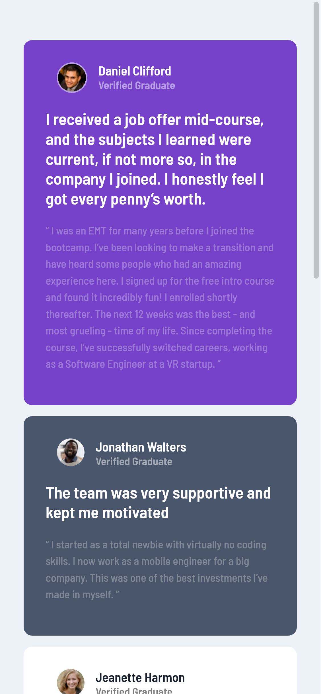
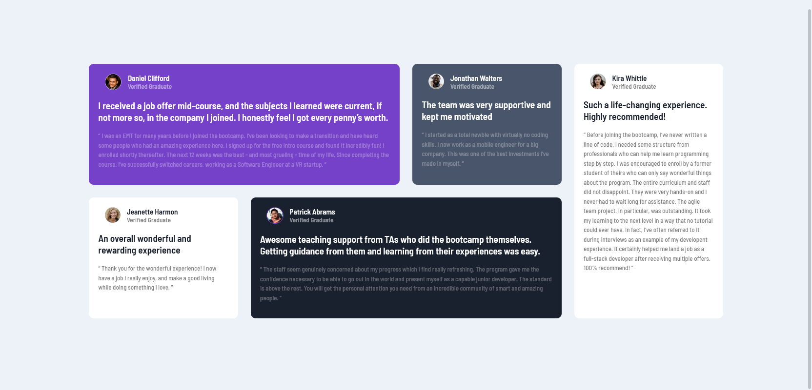

# Frontend Mentor - Testimonials grid section solution

This is a solution to the [Testimonials grid section challenge on Frontend Mentor](https://www.frontendmentor.io/challenges/testimonials-grid-section-Nnw6J7Un7). Frontend Mentor challenges help you improve your coding skills by building realistic projects. 

## Table of contents

- [Frontend Mentor - Testimonials grid section solution](#frontend-mentor---testimonials-grid-section-solution)
  - [Table of contents](#table-of-contents)
  - [Overview](#overview)
    - [The challenge](#the-challenge)
    - [Screenshot](#screenshot)
    - [Links](#links)
  - [My process](#my-process)
    - [Built with](#built-with)
    - [What I learned](#what-i-learned)
    - [Useful resources](#useful-resources)
  - [Author](#author)

**Note: Delete this note and update the table of contents based on what sections you keep.**

## Overview

### The challenge

Users should be able to:

- View the optimal layout for the site depending on their device's screen size

### Screenshot

Mobile 



Desktop




### Links

- Solution URL: [Add solution URL here](https://github.com/gylim0604/FrontendMentor-testimonials-grid)
- Live Site URL: [Add live site URL here](https://frontend-mentor-testimonials-grid-orcin.vercel.app/)

## My process

### Built with

- Semantic HTML5 markup
- CSS custom properties
- CSS Grid
- Mobile-first workflow

### What I learned

IT was my first time using nth-child. Although I understood the concept of it, I never used it before this. An example of it would be as such: 

```html
<div class="card">
  ...
</div>
<div class="card">
  ...
</div>
<div class="card">
  ...
</div>
```
```css
.card:nth-child(1){
  ...
}
```
Where we would select the first card class only.


### Useful resources

- [Mozilla docs](https://developer.mozilla.org/en-US/docs/Web/CSS/:nth-child) - Documentation for nth-child
## Author

- Frontend Mentor - [@gylim0604](https://www.frontendmentor.io/profile/gylim0604)
